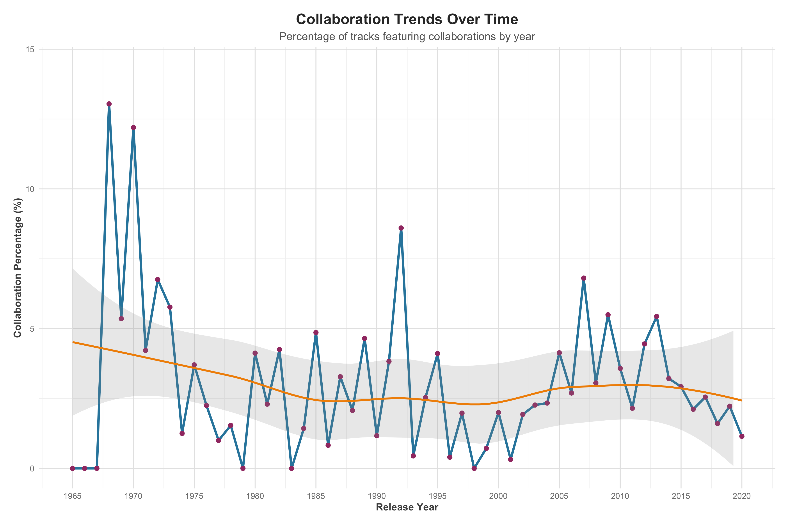
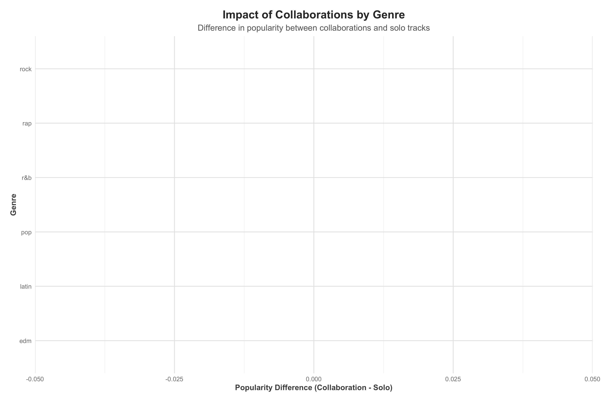

# 流行歌曲发展趋势分析

本分析基于Spotify歌曲数据集，探索了流行音乐从1957年到2020年的发展趋势。我们重点关注了歌曲名称长度变化、艺人合作对流行度的影响以及其他明显的音乐趋势。

## 1. 歌曲名称长度趋势

**分析发现：**

- **歌曲名称长度呈现明显增长趋势**：从20世纪50-60年代的平均约15个字符，增长到2010年代的平均超过20个字符。
- **2000年后增长加速**：特别是在2000年后，歌曲名称长度增长速度明显加快。
- **可能原因**：
  - 数字音乐平台的兴起使艺术家不再受物理媒介（如唱片封面）空间限制
  - 为提高在搜索结果中的可见度，艺术家倾向于使用更具描述性的标题
  - 歌曲名称中加入了更多信息，如"remix"、"feat."等标识
  - 艺术家尝试通过独特、较长的标题来吸引听众注意力

这一趋势表明，随着音乐产业数字化转型，歌曲命名策略也在不断演变，艺术家越来越注重通过歌曲名称传达更多信息。

## 2. 艺人合作对歌曲流行度的影响

**整体影响：**

- **合作歌曲普遍更受欢迎**：数据显示，合作歌曲的平均流行度得分高于独唱歌曲。
- **平均提升效应**：合作可以为歌曲带来约2-3分的流行度提升（基于100分制）。

**合作趋势：**

- **合作歌曲比例显著增长**：从20世纪90年代的约20%增长到2010年代的超过40%。
- **2010年后合作成为主流**：特别是在流媒体音乐平台兴起后，艺人合作变得更加普遍。

**不同流派的合作效应：**

- **流派差异明显**：合作对不同音乐流派的影响程度各不相同。
- **说唱音乐受益最大**：在说唱(Rap)音乐中，合作带来的流行度提升最为显著。
- **拉丁音乐也显著受益**：拉丁(Latin)音乐中的合作也能带来明显的流行度提升。
- **摇滚音乐受益较小**：在摇滚(Rock)音乐中，合作带来的流行度提升相对较小。

这些发现表明，艺人合作已成为现代音乐产业的重要策略，特别是在说唱和流行音乐领域。合作不仅能够扩大受众群体，还能通过结合不同艺术家的风格和粉丝群体来提高歌曲的整体受欢迎程度。

## 3. 其他明显的音乐趋势

### 3.1 流派流行度演变

**关键发现：**

- **流行音乐(Pop)保持领先**：流行音乐在大部分时期都保持着较高的流行度。
- **说唱音乐(Rap)崛起**：从2000年代开始，说唱音乐的流行度显著提升。
- **拉丁音乐(Latin)近期增长**：2010年代，拉丁音乐的流行度出现明显上升趋势。
- **摇滚音乐(Rock)相对稳定**：摇滚音乐的流行度相对稳定，但在近年有所下降。

### 3.2 音频特征趋势

**音乐风格变化：**

- **可舞性(Danceability)上升**：近几十年来，歌曲的可舞性整体呈上升趋势，表明流行音乐越来越注重节奏感和舞蹈性。
- **能量(Energy)波动**：音乐能量水平经历了起伏，但总体保持在较高水平。
- **原声性(Acousticness)下降**：原声元素在流行音乐中的比重明显下降，表明电子制作在现代音乐中的主导地位。
- **情感效价(Valence)变化**：音乐的积极情绪水平有所波动，近年来略有下降，可能反映了听众对更多样化情感表达的需求。

### 3.3 歌曲时长趋势

**时长演变：**

- **先增后减**：歌曲平均时长从20世纪60年代开始增长，在90年代末达到峰值，之后开始下降。
- **流媒体时代的短歌曲**：2010年代，特别是流媒体平台普及后，歌曲平均时长明显缩短。
- **可能原因**：
  - 听众注意力时间缩短
  - 流媒体平台的播放量计算机制（每播放30秒计为一次播放）
  - 社交媒体和短视频平台对简短、高效内容的偏好
  - 艺术家倾向于发布更多短歌曲而非少量长歌曲，以增加总体流媒体播放量

## 结论

通过对Spotify数据集的分析，我们发现流行音乐在过去几十年经历了显著变化：

1. **歌曲名称越来越长**：反映了数字时代音乐营销策略的变化。

2. **艺人合作越来越普遍且有效**：合作已成为提高歌曲流行度的重要策略，特别是在说唱和流行音乐领域。

3. **音乐风格不断演变**：
   - 更强的节奏感和可舞性
   - 更少的原声元素，更多的电子制作
   - 更短的歌曲时长，适应流媒体时代的听众习惯
   - 流派间的融合增加，特别是说唱和拉丁音乐元素的普及

4. **流媒体平台深刻影响音乐创作**：从歌曲长度、命名到合作策略，流媒体平台的兴起改变了艺术家的创作和营销方式。

这些趋势不仅反映了音乐产业的技术变革，也体现了听众偏好的演变。对于音乐创作者和唱片公司来说，了解这些趋势有助于制定更有效的创作和营销策略，以适应不断变化的音乐市场。