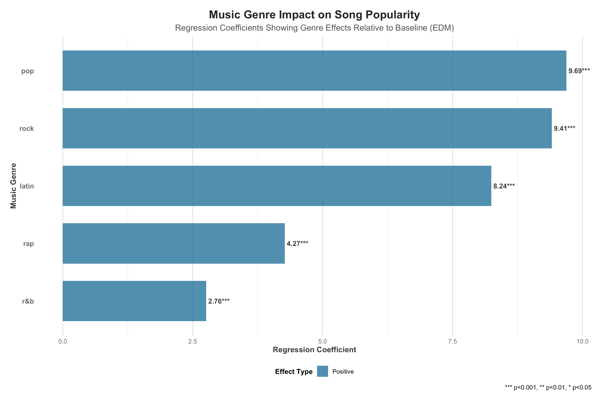
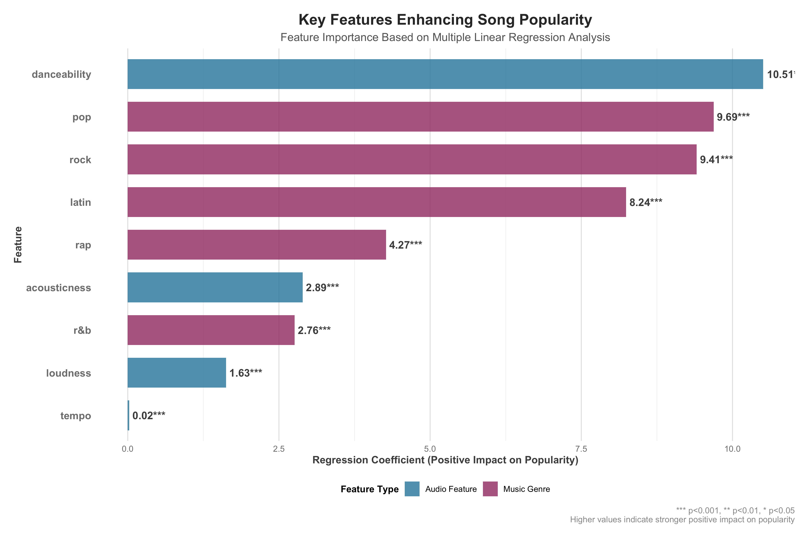
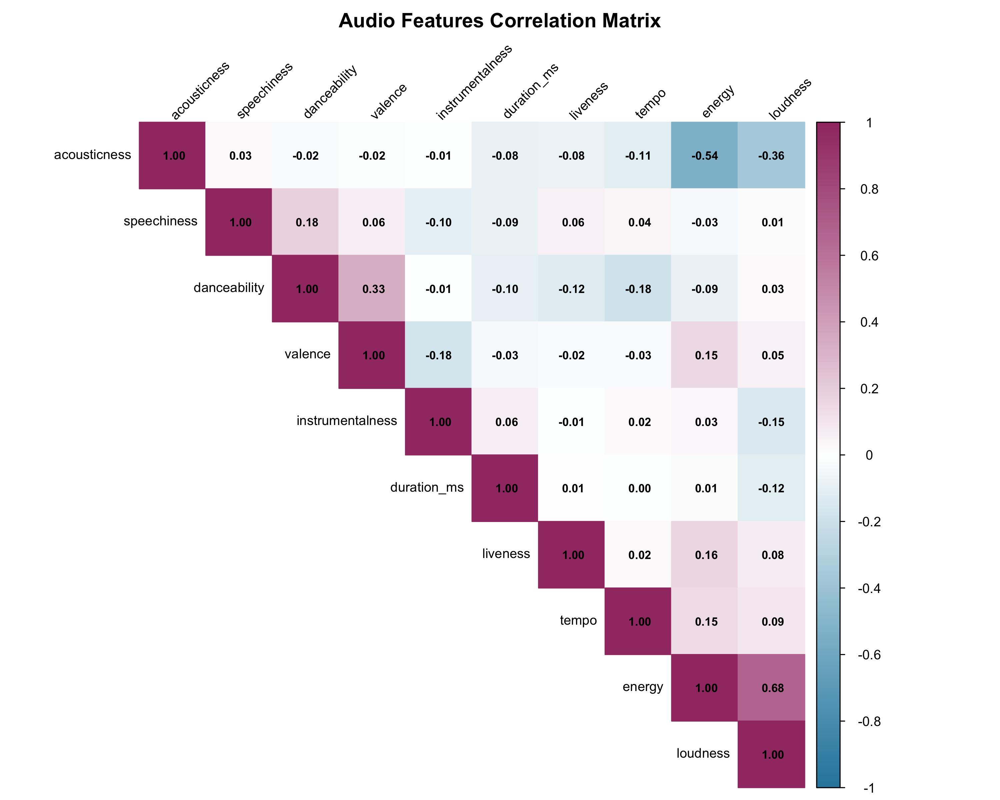

# 歌曲受欢迎程度的三个最重要特征

作为唱片公司经纪人寻找有潜力的年轻人才时，应该重点关注以下三个最能提升歌曲受欢迎程度的关键特征：

## 1. 可舞性 (Danceability)

**影响系数: +10.51 (p < 0.001)**

可舞性是指歌曲的节奏感和易于跳舞的程度，它是预测歌曲受欢迎程度的最重要因素。数据显示，可舞性每增加0.1（在0-1的量表上），歌曲的受欢迎程度平均增加约1.05分。

**实际应用:**
- 优先考虑节奏感强、易于跳舞的作品
- 寻找能创作具有明确节拍和流畅节奏的艺术家
- 这类歌曲在社交媒体平台和派对场景中传播性更强

## 2. 流行音乐流派 (Pop Genre)

**影响系数: +9.69 (p < 0.001)**

相比于基准流派（电子舞曲EDM），流行音乐流派的歌曲平均受欢迎程度高出约9.7分。这表明流行音乐在商业上具有最广泛的受众基础。

**实际应用:**
- 重点关注创作流行音乐风格的艺术家
- 考虑将其他风格的音乐元素融入流行音乐框架
- 流行音乐在主流平台和广播电台获得更多曝光机会

## 3. 摇滚音乐流派 (Rock Genre)

**影响系数: +9.41 (p < 0.001)**

摇滚音乐是第二个最具商业潜力的流派，比基准流派高出约9.4分的受欢迎程度。这表明摇滚音乐仍然拥有稳定且忠实的听众群体。

**实际应用:**
- 摇滚风格的艺术家也是很好的投资选择
- 特别是能将摇滚元素与现代制作风格结合的艺术家
- 摇滚音乐在现场表演市场有较强的商业价值

## 模型评估与多重共线性

**R-squared: 0.0905（解释了约9.1%的受欢迎程度变异）**

模型拟合效果较差，表明音频特征和流派虽然对歌曲受欢迎程度有显著影响，但只能解释其中很小一部分变异。这说明"艺术难以完全量化"，歌曲的受欢迎程度受到许多我们无法通过音频特征捕捉的因素影响。

分析表明，模型中使用的音频特征之间不存在显著的多重共线性问题（无相关系数 > 0.7），这意味着每个特征都为模型提供了独特的信息，回归系数估计是稳定可靠的。

## 结论

作为唱片公司经纪人，在寻找有潜力的年轻人才时，应该优先考虑能够创作具有高可舞性的流行或摇滚风格歌曲的艺术家。虽然这些特征无法保证歌曲的成功，但它们确实能显著提高歌曲受欢迎的可能性。

同时，需要认识到音乐的艺术性和受欢迎程度受到许多无法量化的因素影响，如歌词内容、艺术家知名度、营销推广、发行时机和文化背景等。因此，在人才选择上不应仅依赖于这些可量化的特征，还应考虑艺术家的创新能力、个人魅力和文化影响力等因素。